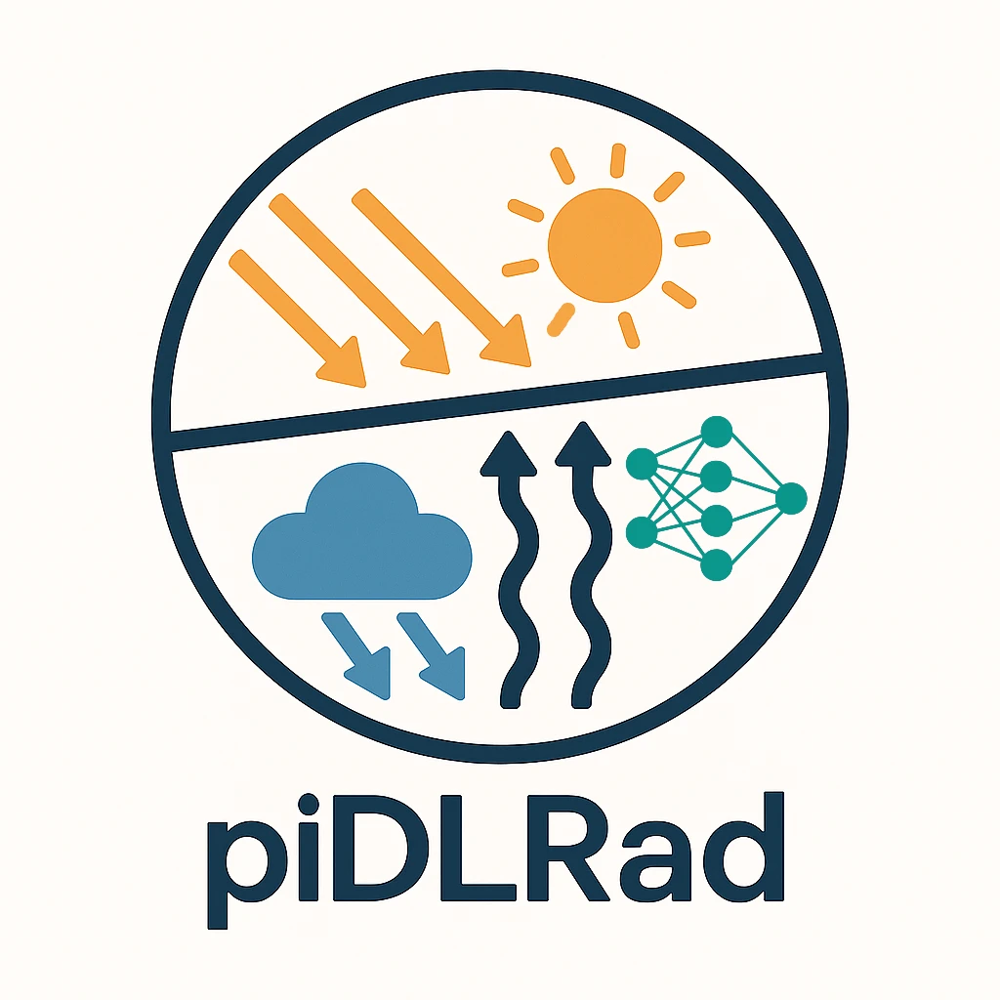

[](https://github.com/swissdatasciencecenter/my-project/releases/latest)
[](https://github.com/swissdatasciencecenter/my-project/actions/workflows/normal.yaml)
[](http://www.apache.org/licenses/LICENSE-2.0.html)

<p align="center">
  
</p>

<h1 align="center">
  piDLRad (physics-informed Deep Learning based Radiation solver)
</h1>
<p align="center">
</p>

<p align="center">
  PyTorch implementation for the paper: 
</p>
<p align="center">
  <a href="">  Revisiting Machine Learning Approaches for Short- and Longwave Radiation Inference in Weather and Climate Models 
</a>


**Authors:**

- [Salman Mohebi](https://github.com/salmanmohebi)
- [Firat Ozdemir](https://github.com/firatozdemir)


## Installation

If you do not have conda, you can install [Miniconda](https://docs.conda.io/en/latest/miniconda.html):

- Download the Miniconda installer for your OS from the [official page](https://docs.conda.io/en/latest/miniconda.html).
- Run the installer and follow the prompts.

Once conda is available, it is recommended to use a conda environment to manage dependencies and avoid conflicts:

```bash
conda create -n pidlrad python=3.8
conda activate pidlrad
```

You can install piDLRad using pip:

```bash
pip install git+https://github.com/swissdatasciencecenter/deepcloud-pidlrad.git
```

Alternatively, clone the repository and install in editable mode:

```bash
git clone https://github.com/swissdatasciencecenter/deepcloud-pidlrad.git
cd deepcloud-pidlrad
pip install -e .
```

## Usage

Describe the installation instruction here.


## Acknowledgement

This work was funded through a grant by the Swiss Data Science Center (SDSC grant C20-03). This research was supported by computation resources provided by the EXCLAIM project funded by ETH Zurich (CSCS project number d121). The Center for Climate Systems Modeling (C2SM) at ETH Zurich is acknowledged for providing technical and scientific support. Sebastian Schemm and Stefan Rüdisühli are supported by the European Research Council, H2020 European Research Council (grant no. 848698). From November 2024 onward, Guillaume Bertoli was supported by the SNF postdoc mobility grant P500PN_225397.

## Copyright

Copyright © 2025-2028 Swiss Data Science Center (SDSC),
[www.datascience.ch](http://www.datascience.ch/). All rights reserved. The SDSC
is jointly established and legally represented by the École Polytechnique
Fédérale de Lausanne (EPFL) and the Eidgenössische Technische Hochschule Zürich
(ETH Zürich). This copyright encompasses all materials, software, documentation,
and other content created and developed by the SDSC.
